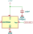
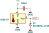

# Temperature sensors with linear voltage output

### TMP35 / TMP36 / TMP37 

[datasheet](https://www.analog.com/media/en/technical-documentation/data-sheets/tmp35_36_37.pdf)

Very close to popular in Arduino community LM35 sensor, but TMP3x series can work with 3.3V power supply and can't use higher voltage supply.  Per datasheet is designed to operate when produces <2 V as output!

|                                                  |               | TMP35        | TMP36        | TMP37      |
| ------------------------------------------------ | ------------- | ------------ | ------------ | ---------- |
| Scale factor, [mV/°C]                            |               | 10           | 10           | 20         |
| Voltage at reference temperature, [mV]           | $V_{T_{ref}}$ | 250          | 750          | 500        |
| Reference temperature, [°C]                      | $T_{ref}$     | 25           | 25           | 25         |
| Applicable temperature range per datasheet, [°C] |               | +10 ... +125 | -40 ... +125 | +5 ... 100 |

Some estimated values:

|                                          | TMP35 | TMP36 | TMP37 |
| ---------------------------------------- | ----- | ----- | ----- |
| Voltage at 0 °C, [V]                     | 0.0   | 0.5   | 0     |
| **Temperature at defined voltage**, [°C] |       |       |       |
| 0 V                                      | 0.0   | -50.0 | 0     |
| 1.1 V                                    | 110   | 60    | 55    |
| 2.0 V                                    | 200.0 | 150.0 | 100   |
| 3.3 V                                    | 330.0 | 280.0 | 165.0 |
Reasoning behind selected voltages:

- 2.0 V : max suggested output per datasheet
- 3.3 V : max theoretical voltage that 3.3V MCU can tolerate
- 1.1 V : There is an option to use 1.1V as ADC reference voltage

### LM35 / LM45 / LM50

Datasheets: [LM35](https://www.ti.com/lit/ds/symlink/lm35.pdf), [LM45](https://www.ti.com/lit/ds/symlink/lm45.pdf) and [LM50](https://www.ti.com/lit/ds/symlink/lm50.pdf)

This sensor can't be powered from 3.3V, and can provide more than 3.3V as output. Per datasheet they are not expected to provide more than 1.75V output, might be a good idea to have 1.8V zener on output. 

|                                                  |               | LM35         | LM45         | LM50        |
| ------------------------------------------------ | ------------- | ------------ | ------------ | ----------- |
| Scale factor, [mV/°C]                            |               | 10           | 10           | 10          |
| Voltage at reference temperature, [mV]           | $V_{T_{ref}}$ | 250          | 1000         | 750         |
| Reference temperature, [°C]                      | $T_{ref}$     | 25           | 100          | 25          |
| Applicable temperature range per datasheet, [°C] |               | -55 ... +150 | -20 ... +100 | -40 ... 125 |

Some estimated values:

|                                          | LM35 | LM45 | LM50  |
| ---------------------------------------- | ---- | ---- | ----- |
| Voltage at 0 °C, [V]                     | 0.0  | 0    | 0.50  |
| **Temperature at defined voltage**, [°C] |      |      |       |
| 0 V                                      | 0.0  | 0    | -50.0 |
| 1.1 V                                    | 110  | 110  | 60    |
| 1.75 V                                   | 175  | 175  | 125   |
| 3.3 V                                    | 330  | 330  | 280   |

## Estimation formulas

- for `Offset` or `Voltage at 0 °C, [V]`:
$$ 
Offset = V_{T_{ref}} - \frac{T_{ref}}{Scale \ factor}
$$

- Temperature at defined voltage:
$$ T_{°C} = \frac{V_{output} - V_{T_{ref}}}{Scale \ factor} + T_{ref} $$

Calculation file is [here](calculators/linear_temperature_sensors.xlsx){:linear_temperature_sensors}