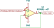
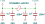

# ADC

Thus, to read and calculate voltage at sensor output pin:

$$
V_{input}=\frac{ADC_{input}}{ADC_{resolution}} \times V_{ref}
$$

where: 

- $ADC_{input}$ : voltage level at analog input pin
- $ADC_{resolution}$ : resolution range of certain microcontroller or ADC converter. Can be calculated as: 

$$ADC_{resolution}=2^{bits}-1$$

- $bits$ : ADC resolution digits of certain microcontroller. For many STM32 equals to 12.
- $V_{ref}$ : reference voltage level. 

So, the measured is roughly equal to:

$$
V_{input}=\frac{ADC_{input}}{2^{12}-1} \times 3.3 = ADC_{input} \times 0.000806 [V]=ADC_{input} \times 0.806 [mV]
$$

Which also mean that we can read the voltage with resolution of 0.806 mV.

## Some improvement

### On measuring input

If the measuring chain of microcontroller itself introduces the error, it is nice to "isolate" sensor. Especially, if voltage dividers are used.

This is often achieved with non-inverting attenuator schematics:

a.k.a. Voltage Follower, Unity Gain Buffer

However, notice that MCP601 doesn't quite provide the output voltage near VCC region. Thus, if expecting signal near 3.3V, than power it with 5V. The schematics above is sufficient on frequencies up to approx. 250 KHz.

### On MCU board side

While MCU might provide 12-bit ADC, to obtain better than 10-bits resolution, consider:

- separate analog and digital ground (in case of STM32: VSSA and GNDA)
- provide extra filter for analog power supply
- add capacitors to provide stable power:
	- typical combo 2 × Tantalum 1μF + 2 × ceramic 100nF
	- if MCU has multiple VDD pins, add one extra 100nF capacitor per each extra pin

