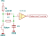

# Debouncing

Mechanical switches may have issue widely referred to as “bouncing”, when fact of single contact closure is recognized as several because of mechanical nature.

Such switches include:

- buttons (push-buttons, tact-buttons, switches)
- encoders (incremental encoders, flow-meters)
- reed switches
- even some digital Hall-sensors has this problem, if signal wires from sensors are
	- close to power supply lines
	- or not shielded
- too close to source of altering magnetic fields, like in some wheels of electrical bikes [proof](https://www.youtube.com/watch?v=HW3xqTXIlfo)

For most mechanical buttons, debouncing time of 10 ms is considered as sufficient and is referred to in further calculations.

## RC-filter

This is the part of schematics from STM32 Discovery boards

## Discrete solution with Schmidt trigger

Datasheets from:

- [Texas Instruments](https://www.ti.com/lit/ds/symlink/sn74hc14.pdf) 
- [Nexperia](https://assets.nexperia.com/documents/data-sheet/74HC_HCT14.pdf)

For buttons and encoders:

This solutions is described in following:

- Würth Elektronik Support Note [Contact debounce circuit for switches](https://www.we-online.com/catalog/media/o185480v410%20SN015_Contact%20debounce%20circuit%20for%20switches.pdf)
- Texas Instruments Product Overview [Debounce a switch](https://www.ti.com/lit/ab/scea094/scea094.pdf)
- [A Guide to debouncing](https://my.eng.utah.edu/~cs5780/debouncing.pdf)

However, for encoder it also can use cascading of triggers as per TI 74HC14 Datasheet, rev. J, Fig. 5 (this schematic was removed from later revisions). 

## Specialized IC Solution

### MC14490

[Datasheet](https://www.onsemi.com/pdf/datasheet/mc14490-d.pdf) from OnSemi and [Application note](https://www.bourns.com/docs/technical-documents/technical-library/sensors-controls/technical-notes/Bourns_enc_sgnl_cond_technote.pdf) from Bourns.

Hex contact debounce IC that would require only 1nF capacitor for functioning.
### LogiSwitch LS30

Specialized encoder (or 3-channel) debouncer
[Datasheet]()